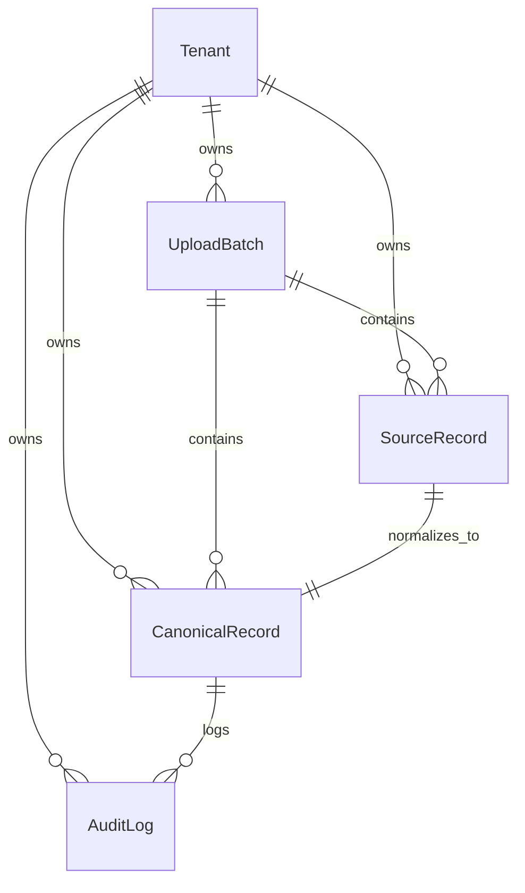

# Database Schema & Model Design

This document details the database schema, data relationships, multi-tenant isolation, auditing system, and validation state machine for the BreatheESG platform.

---

## 1. Entity Relationship Diagram (ERD)

The system is centered around a unified **Canonical Record** which holds normalized activity data and calculated GHG emissions in kg CO2e. The relationships are structured as follows:



---

## 2. Table Schemas

### `Tenant`
Stores organizational boundaries. Enables data segregation (multi-tenancy) inside the unified database.
- `id` (UUID, Primary Key): Globally unique identifier.
- `name` (VARCHAR, Unique): Organization name.
- `created_at` (TIMESTAMP): Date when the tenant was provisioned.

### `UploadBatch`
Tracks each ingestion session.
- `id` (UUID, Primary Key): Globally unique identifier.
- `tenant_id` (FK to `Tenant`): Isolates this upload batch to a tenant.
- `source_type` (VARCHAR): SAP fuel CSV (`SAP_FUEL`), utility billing CSV (`UTILITY_ELECTRICITY`), or corporate travel JSON (`TRAVEL_JSON`).
- `filename` (VARCHAR): Original name of the uploaded spreadsheet or ingestion stream identifier.
- `status` (VARCHAR): Processing state (`PENDING`, `PROCESSING`, `COMPLETED`, `FAILED`).
- `error_message` (TEXT, Nullable): General batch parsing failure description.
- `created_at` (TIMESTAMP): Time of ingestion.
- `created_by_id` (FK to `User`, Nullable): The analyst who uploaded the batch.

### `SourceRecord`
Acts as the immutable "source of truth" by archiving the raw payload exactly as it arrived from the source system.
- `id` (UUID, Primary Key).
- `tenant_id` (FK to `Tenant`): Field-level tenant isolation.
- `batch_id` (FK to `UploadBatch`): Maps the record to its ingestion batch.
- `row_number` (INTEGER): Index of the row/record in the original import (highly useful for error reporting).
- `raw_payload` (JSONB): Fully preserved raw JSON object/row.
- `status` (VARCHAR): Processing state (`UNPROCESSED`, `NORMALIZED`, `VALIDATION_FAILED`).

### `CanonicalRecord`
The unified representation of ESG activity data.
- `id` (UUID, Primary Key).
- `tenant_id` (FK to `Tenant`): Field-level tenant isolation.
- `source_record_id` (FK to `SourceRecord`, Nullable): Relates to the raw ingested payload (nullable to support manual entries).
- `batch_id` (FK to `UploadBatch`, Nullable).
- `scope` (VARCHAR): Scope classification (`Scope 1`, `Scope 2`, `Scope 3`).
- `category` (VARCHAR): Descriptive classification (e.g. `Fuel Combustion - Diesel`, `Purchased Electricity - Grid Consumption`).
- `activity_date` (DATE): Normalized date of the activity.
- `original_value` (DECIMAL): Inflow value before conversion.
- `original_unit` (VARCHAR): Inflow unit before conversion (e.g. Gallons).
- `normalized_value` (DECIMAL): Converted value.
- `normalized_unit` (VARCHAR): Standardized unit (Liters for fuel, kWh for electricity, Passenger-km for travel).
- `co2e_emissions` (DECIMAL): Calculated carbon footprint (in kg CO2e).
- `approval_status` (VARCHAR): Workflow state (`PENDING`, `APPROVED`, `REJECTED`).
- `is_locked` (BOOLEAN): Audit lock flag. If true, no edits can be made.
- `suspicious` (BOOLEAN): Indicates if a suspicious rule triggered during normalization.
- `suspicious_reasons` (JSONB): Array of warning strings.
- `validation_failed` (BOOLEAN): Indicates if normalization rules threw errors.
- `failure_reason` (TEXT, Nullable): Parsing/validation error log.

### `AuditLog`
Chronicles every operation on a `CanonicalRecord`.
- `id` (UUID, Primary Key).
- `tenant_id` (FK to `Tenant`): Field-level tenant isolation.
- `canonical_record_id` (FK to `CanonicalRecord`): Links log to the affected data row.
- `action` (VARCHAR): Performed action (`CREATE`, `EDIT`, `APPROVE`, `REJECT`, `UNLOCK`).
- `changed_by_id` (FK to `User`, Nullable): User who performed the change.
- `timestamp` (TIMESTAMP): Precise timing.
- `previous_state` (JSONB): Key-value snapshot of changed fields before the action.
- `new_state` (JSONB): Key-value snapshot of changed fields after the action.
- `comments` (TEXT): Analyst explanation for the change (mandatory for edits/approvals).

---

## 3. Data Flow & Normalization Strategy

### SAP Fuel Ingestion (Scope 1)
- **Standardized Unit**: `Liters`
- **Formula**: `Quantity * 3.78541` if unit is Gallons; `Quantity` if Liters.
- **Emissions (kg CO2e)**: `Liters * 2.68` (Diesel) or `Liters * 2.31` (Petrol).

### Utility Electricity Ingestion (Scope 2)
- **Standardized Unit**: `kWh`
- **Formula**: Direct import (or standard `MWh * 1000` conversion).
- **Emissions (kg CO2e)**: `kWh * 0.40` (Location-based grid intensity).

### Corporate Travel Ingestion (Scope 3)
- **Standardized Unit**: `Passenger-km`
- **Formula**: `distance_miles * 1.60934`
- **Emissions (kg CO2e)**: `Passenger-km * 0.15` (Economy class) or `Passenger-km * 0.29` (Business class).

---

## 4. Lifecycle & Lock States

```mermaid
stateDiagram-sync
    [*] --> PENDING : Ingestion / Manual Create
    PENDING --> APPROVED : Analyst Approves
    PENDING --> REJECTED : Analyst Rejects
    PENDING --> PENDING : Analyst Edits
    
    APPROVED --> APPROVED : is_locked = True (Locked for Audit)
    REJECTED --> PENDING : Analyst Re-edits
```

1. **Ingestion**: Uploading a file processes every row. If validation fails, a `CanonicalRecord` is still created with `validation_failed=True` and `approval_status='PENDING'`, making it visible to the analyst in the review queue.
2. **Review/Edit**: The analyst can correct values on a `PENDING` record (either repairing a failed row or overriding outlier values). Doing so records an `EDIT` action in the `AuditLog` showing a diff of changes and requires a justification. Recalculation of normalized units and CO2e emissions triggers automatically upon saving.
3. **Approval**: Clicking Approve transitions the record to `APPROVED` and sets `is_locked` to `True`. Subsequent changes to this record via the API return a `400 Bad Request`.
